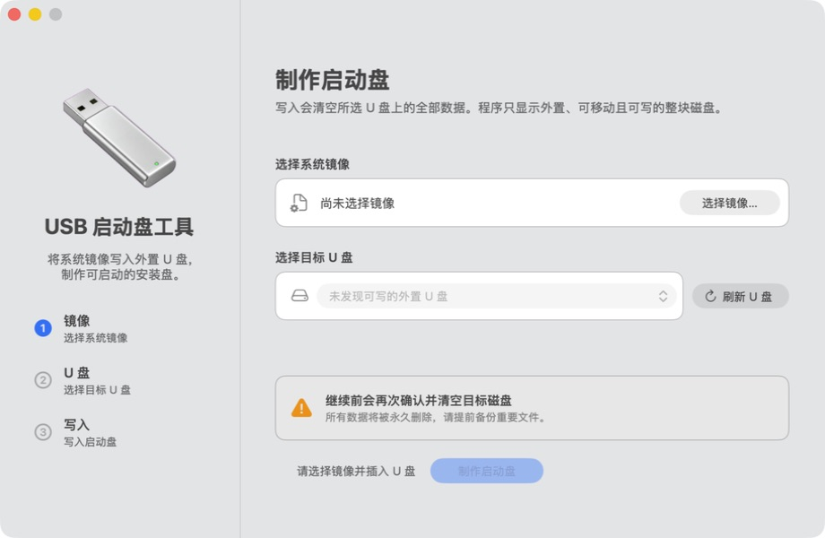

# USB Bootable Drive Tool

[](https://github.com/fanny7d/USB-Bootable-Drive-Tool/actions/workflows/macos.yml)
[](LICENSE)


A native macOS AppKit utility for writing ISO and IMG images to removable USB drives. It provides strict target filtering, a system-controlled privilege boundary, and a polished glass-style interface.

**[简体中文](README.zh-CN.md)**



> [!CAUTION]
> Writing an image permanently overwrites the selected USB drive. Back up important data and verify the device name, capacity, and identifier before confirming.

## Features

- Native AppKit interface with macOS system materials.
- ISO and IMG image selection.
- Automatic discovery and hot-plug refresh for external USB media.
- Shows only whole, external, removable, writable physical disks.
- Revalidates disk identity and exact byte capacity before destructive work.
- Keeps administrator password entry in Terminal and system `sudo`.
- Writes through `/dev/rdiskN`, then runs `sync` and safely ejects the drive.
- Custom Dock/Finder icon, standard menus, and accessible UI labels.
- Reproducible command-line build with no third-party runtime dependencies.

## Requirements

- macOS 13 Ventura or newer.
- Xcode Command Line Tools (`xcode-select --install`).
- A removable USB drive.
- A bootable/hybrid ISO or IMG compatible with the target computer.

## Build and run

Clone the repository and run:

```bash
git clone https://github.com/fanny7d/USB-Bootable-Drive-Tool.git
cd USB-Bootable-Drive-Tool
./script/build_and_run.sh --verify
```

The generated application is `USB启动盘工具.app` in the repository root. You can also double-click `build.command`.

Available development modes:

```bash
./script/build_and_run.sh --build-only
./script/build_and_run.sh --debug
./script/build_and_run.sh --logs
./script/build_and_run.sh --telemetry
./script/build_and_run.sh --verify
```

## Usage

1. Insert the removable USB drive. The app refreshes automatically.
2. Select an `.iso` or `.img` system image.
3. Confirm the exact target name, capacity, identifier, and protocol.
4. Click **制作启动盘** and review the destructive confirmation.
5. Enter the macOS login password in the Terminal window opened by the app.
6. Keep the drive connected until writing, synchronization, and eject complete.

## Safety model

The app deliberately maintains two independent validation layers:

- The GUI filters candidates using `diskutil` plist data.
- The Terminal job re-reads the target immediately before unmounting and writing.

The GUI never reads or saves an administrator password. See [Architecture](docs/ARCHITECTURE.md) for the full write boundary and safety invariants.

## Testing

Run the complete non-destructive validation suite:

```bash
./script/test.sh
```

Build, launch, disk discovery, and code-signing checks do **not** prove that a real image was written or that the target computer can boot it. Follow the isolated disposable-media procedure in [Testing](docs/TESTING.md) for destructive acceptance.

## Project structure

```text
Sources/USBBootableDriveTool/  AppKit application source
Assets/                        App and sidebar artwork
script/                        Build, run, test, and icon tooling
docs/                          Architecture and testing documentation
.github/                       CI and contribution templates
```

## Contributing and security

Contributions are welcome. Read [CONTRIBUTING.md](CONTRIBUTING.md) before opening a pull request. Report security issues privately according to [SECURITY.md](SECURITY.md), especially anything that could weaken disk selection or privilege boundaries.

## Distribution note

Local builds are ad-hoc signed for development. Public binary distribution requires an Apple Developer ID signature and notarization. Building from source does not require a paid Apple developer account.

## License

Released under the [MIT License](LICENSE).
